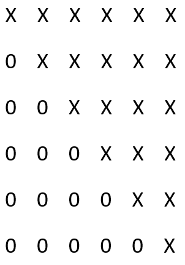

# Matrix_Calculations
- System of Linear Equations   
- Eigenvalues and Eigenvectors  
- Singular Values Decompose  
- Least Square

## Purpose
This project is to implement certain matrix operations of **dense matrices**,  (Dense matrices are the matrices that have very limited number of zero elements.) including solving system of linear equations, finding the Eigenvalues and Eigenvectors of a matrix, solving least square problems, and performing singular values decompose.  Matrices of the implementation are represented by 2D long double array and it should be sufficient for matrices with sizes less than 10,000.  If sizes of matrices are large, matrix elements should be stored in multiple machines and the implementation of the metioned operations should be modified accordingly.

## Implementaion
Throught out the project, I define the data type of ***long double*** as ***LDouble***, ***LDouble*** **_*_** as ***LDPtr***, and ***unsigned int*** as ***MInt***.
### class DenseMatrix   
The class defines some calculations on square matrices, including solving system of linear equations and finding Eigenvalues and Eigenvectors.   
- ***DenseMatrix::DenseMatrix(LDPtr*** **_*_** ***pMatrix, MInt nSize)***   
- ***void DenseMatrix::setValue(MInt colPos, MInt rowPos, LDouble dValue)***   
The size passed to the constructor has to be greater than zero; otherwise, the constructor will throw *std::invalid_argument*.  If *pMatrix* is not nullptr and *pMatrix[i]* is not nullptr for some unsigned integer *i* that is less *nSize*, the constructor will copy values into the class memory.  If a matrix is too large and it is not practical to hold two copy of the same matrix on the same time, caller should pass nullptr to the constructor and call the method of ***setValue*** repeatedly, which will set the value on the *colPos*th column and *rowPos*th row (the column and row counts start from zero).
- ***bool DenseMatrix::solvedByHouseholder(LDPtr pVector, MInt nSize)***   
The vector passed to the method cannot be nullptr and the size has to match the size of matrix in the instance of the class.  If it is not the case, the method will throw std::invalid_argument.  The first step of the method uses a series of Householder matrices, *H(1)*, *H(2)*, ..., *H(n-1)* to left multiply the targeted matrix, where parentheses represent indeces, so that *H(n-1)H(n-2)...H(2)H(1)A* is a matrix having upper triangle form, where *A* represents the original matrix.  For example, the resulting matrix will look like   

## Testing

## Future Modification
