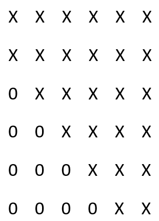

# Matrix_Calculations
- System of Linear Equations   
- Eigenvalues and Eigenvectors  
- Singular Values Decompose  
- Least Square

## Purpose
This project is to implement certain matrix operations of **dense matrices**,  (Dense matrices are the matrices that have very limited number of zero elements.) including solving system of linear equations, finding the Eigenvalues and Eigenvectors of a matrix, solving least square problems, and performing singular values decompose.  Matrices of the implementation are represented by 2D long double array and it should be sufficient for matrices with sizes less than 10,000.  If sizes of matrices are large, matrix elements should be stored in multiple machines and the implementation of the metioned operations should be modified accordingly.

## Implementaion
Throught out the project, I define the data type of ***long double*** as ***LDouble***, ***LDouble*** **_*_** as ***LDPtr***, and ***unsigned int*** as ***MInt***.   
### class Householder  
This class represents a Householder matrix, which is generated by a vector x and has a form of   
H = I - beta * v * transpose(v),   
where beta is a constant real number.  Let _H*x_ be a vector, then the first element of this vector is non-zero and all the remaining entries are zeros.  
### class Givens
The class represents a Givens matrix, which is generated by two elements in a vector x.  It has a property such that _G*x_ has zero entry on the required position. Since the class of Householder and Givens are in the implementation of DenseMatrix class methods and GeneralMatrix class methods only and I don't expect Householder and Givens would be used in other places, no further descriptions about the Householder and Givens will be added here.  The header file *matrix_calculations.h* contains detailed descriptions of Householder and Givens class.
### class DenseMatrix   
The class defines some calculations on square matrices, including solving system of linear equations and finding Eigenvalues and Eigenvectors.   
- ***DenseMatrix::DenseMatrix(LDPtr*** **_*_** ***pMatrix, MInt nSize)***   
- ***void DenseMatrix::setValue(MInt colPos, MInt rowPos, LDouble dValue)***   
The size passed to the constructor has to be greater than zero; otherwise, the constructor will throw *std::invalid_argument*.  If *pMatrix* is not nullptr and *pMatrix[i]* is not nullptr for some unsigned integer *i* that is less *nSize*, the constructor will copy values into the class memory.  If a matrix is too large and it is not practical to hold two copy of the same matrix on the same time, caller should pass nullptr to the constructor and call the method of ***setValue*** repeatedly, which will set the value on the *colPos*th column and *rowPos*th row (the column and row counts start from zero).
- ***bool solvedByCholesky(LDPtr pVector, MInt nSize)***   
This method assumes that the targeted matrix is symmetrical and positively defined.  This method decomposes the matrix to be the product of a lower triangle matrix and its transpose and solves two system of linear equations.
- ***bool DenseMatrix::solvedByHouseholder(LDPtr pVector, MInt nSize)***   
The vector passed to the method cannot be nullptr and the size has to match the size of matrix in the instance of the class.  If it is not the case, the method will throw std::invalid_argument.  The first step of the method uses a series of Householder matrices, *H(1)*, *H(2)*, ..., *H(n-1)* to left multiply the targeted matrix, where parentheses represent indeces, so that *H(n-1)H(n-2)...H(2)H(1)A* is a matrix having upper triangle form, where *A* represents the original matrix.  For example, the resulting matrix will look like  .  
The generated Householder matrices are also used to multiply the provided vector; that is to calculate *H(n-1)H(n-2)...H(2)H(1)v*, where *v* is the vector provided.  Lastly, solve the resulting system of linear equations beginning from the last row to the first one.
- ***void DenseMatrix::schurDecomposeByFrancisQR()***   
The method first reduces the targeted matrix to upper Hessenberg form by multiplying a series of Householder matrices on both sides of the targeted matrix; that is to calculate *H(n-2)...H(2)H(1)AH(1)H(2)...H(n-2)*. By doing this, the resulting matrix will have the same Eigenvalues as the original one. Using dimension of six, an upper Hessenberg matrix looks like   .  
To resulting upper Hessenberg matrix is to multiply another series of Householder matrices on both sides to generate the real Schur form, such as  .   
There are two possible results of the calculations: some real Eigenvalues locate at diagonal positions of the matrix or some 2x2 matrices locate at diagonal positions, whose Eigenvalues are also the Eigenvalues of the original matrix. The corresponding transformation matrix is also calculated. 
- ***void DenseMatrix::schurDecomposeBySymmetricQR()***   
Similiar to the method above, this method also reduce the targeted matrix to upper Hessenberg form but assuming the matrix is symmetrical.  The resulting matrix has special form that, except for the diagonal positions and their surronding positions, all other entries are zeros, for example, .   
The resulting matrix is multiplied by a series of Givens matrix on sides and will generate a diagonal matrix, for example,  .   
The Eigenvalues are stored at the diagonal positions of matrix and columns of transformation matrix are corresponding Eigenvectors.   
### class GeneralMatrix
This class defines methods of solving least square problems and singular value decompose.   
- ***GeneralMatrix::GeneralMatrix(LDPtr*** **_*_** ***pMatrix, MInt colSize, MInt rowSize)***   
- ***void GeneralMatrix::setValue(MInt colPos, MInt rowPos, LDouble dValue)***
The argument colSize passed to the constructor should be greater than or equal to rowSize; if not, the constructor will throw std::invalid_argument. If *pMatrix* is not nullptr and *pMatrix[i]* is not nullptr for *i* less than *rowSize*, constructor will copy memory into the class. If the matrix is large so that it is not practical to pass memory to the constructor, caller should call **setValue** repeatedly to set the value of every needed entry.   
- ***bool GeneralMatrix::solveLeastSquareFullRank(LDPtr pVector, MInt nSize)***   
This method assumes the matrix has a rank equal to the row size and solves least square problem with the given vector by finding the least norm solution.  The matrix is left multiplied by a series of Householder matrix so that *H(n-1)H(n-2)...H(2)H(1)A* is an upper triangle matrix, for example, .   
The vector passed as argument is also multiplied by this series of Householder; that is to calculate *H(n-1)H(n-2)...H(2)H(1)v*, where is the vector passed to the method.  Finally, solve system of linear equations with size equal to row size and set entries of vector at positions larger than rowSize to zero.
- ***bool GeneralMatrix::solveLeastSquare(LDPtr pVector, MInt nSize)***   
This method also solves least square problem with the given vector but doesn't assume to have a rank of row size.  This method first multiplies a series of Householder matrices to produce a trapezoid-like matrix, for example, .   
During the process, column with largest norm will be considered first and the rank is determined. The same list of Householder matrices are also used to multiply the given vector.  Columns of the resulting matrix are exchanged accordingly, multiply another series of Householder matrices, and are exchanged backword accordingly to obtain an upper triangle matrix, for example, .   
Finally, solve the system of linear equations with size of the rank and set the entries at positions larger than the rank to zeros.   
- ***void GeneralMatrix::singularValueDecompose()***   
This method calculates all singular values and the corresponding transformation matrices.  The targeted matrix is multiplied by proper Householder matrices to form a matrix such that, except for the diagonal positions and the positions above them, all the remaining enetries are zeros, for example,  .   
The resulting matrix is then multiplied by proper Givens matrices so that the resulting matrix only has non-zero elements at diagonal position, for example, .   
The singluar values are stored in the diagonal positions of the resulting matrix, and two additional transformation matrices are also calculated.

## Future Modification
The classes defined here are limited.  The implementation should be modified when columns of a large matrix are stored in multiple machines.  Implementaions on sparse matrix should also be added in future, which is a matrix that has limit amount of non-zero entries.
